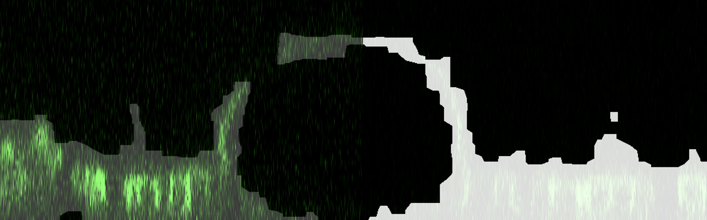

# Dottamine

Dottamine is a low quality image feature detector. It works by binning the image, masking and expanding to the original size.

Dottamine can work with several image types. It can work from 2D images up to 4D images.

Just download [dottamine](https://minhaskamal.github.io/DownGit/#/home?url=https://github.com/P8UXaE/dottamine).


## Instalation

1. Download the `dottamine` package:
- Download the `dottamine` package (provisional name) from github.

2. **Recommended**: Create a python virtual environment:
- Open a terminal or command prompt.
- Run the following command to create a Python virtual environment: `python -m venv your_venv_name`. 
- Activate the virtual environment:
    - On windows: `.\your_venv_name\Scripts\activate`
    - On UNIX: `source your_venv_name\bin\activate`

3. Navigate to the `dottamine\dottamine` Directory:
- In the terminal or command prompt, move to the `dottamine\dottamine` directory. Confirm that you see the `setup.py` file and the `MANIFEST.in` file in this directory.

4. Install the Package:
- Execute the following `pip` command to install the package inside the virtual environment: `pip install .`.

5. Post-Installation Cleanup:
- After a successful installation, you can safely remove the downloaded folder (the one containing `setup.py` and `MANIFEST.in`), as the package is now installed in the virtual environment.


## Usage


To use Dottamine, you just need to import ```dotim``` as the image processing algorithm.

```
from dottamine import dotim
```

Then you have to load the image and, for instance, get the binary mask of the image.

```
processed_image = dotim('image route')
processed_mask = processed_image.get_mask(...)
```


## Documentation

Dottamine is an image processing package designed to enhance low-quality images by leveraging a unique combination of binning, masking, and morphological operations. The process involves the following steps:

1. Binning: The image is iteratively downsampled, reducing its size based on the specified bin size. The package records the positions of the brightest pixels during this process.

2. Blurring and Masking: The binned image is subjected to a blurring operation, and a mask is generated using the mean. This mask is applied to the original image, effectively highlighting key features.

3. Mask Expansion: The masked image undergoes an expansion process, guided by the previously recorded positions of the brightest pixels. This step helps restore relevant details.

4. Delaunay Triangulation: The package performs Delaunay triangulation on the image to create a mesh of triangles.

5. Triangle Filtering: The triangles generated in the previous step are filtered to select those containing the desired features.

6. Morphological Operations: Basic morphological operations such as closing and opening are applied to fill the space inside the selected triangles, refining the image.

By combining these techniques, Dottamine aims to improve the quality of images, particularly in scenarios where details are obscured or compromised.

### Initialization

To initialize the processing, create an object using the `dotim` class. This class takes the following parameters:

- `image`: A numpy array representing a single image channel or a string representing the image route. It can be a 2D, 3D, or 4D array / image.
- `is2D`: A boolean, either `True` or `False` (default is `False`), indicating whether the arrays are 2D or 3D images. When the array has a fourth dimension (time dimension), leave it as `False`.
- `treat_3D_as_2D`: A boolean, either `True` or `False` (default is `False`), determining if you want to process the 3D image slice by slice. If set to `True`, note that it will process the image as the object contains it. This means that if the original image is a top-bottom view (z-axis), the slices will be z slices. If you wish to process slices along other axes individually, you must rotate the image accordingly.

### Functions

#### `conv_deconv` Function

The `conv_deconv` function is designed for iterative binning, masking, and unbinning of an image. It takes the following parameters:

- `times`: An integer representing the number of iterations for binning the image.
- `binshape`: A tuple specifying the shape of the binned pixels. The tuple elements are ordered as follows: (z-axis, y-axis, x-axis).
- `v`: Verbose. Add `'+'` to follow the process.

**Note**: The results of the operation depend on both `times` and `binshape`. It is crucial to choose appropriate values for meaningful outcomes. For instance, creating a mask on a 1px * 1px image may not yield desirable results. Our tests indicate that optimal outcomes are achieved by masking 100px * 100px images that have been binned from an 800px * 800px image three times with a bin shape of (2,2).

#### `get_mask` Function

The `get_mask` function returns a binary mask by processing the image through binning, masking, unbinning, obtaining coordinates, creating Delaunay triangles, and filling them before applying basic morphological operations. While it typically operates on the result of the `conv_deconv` function, executing it separately is also possible. It takes the following parameters:

- `times`: An integer representing the number of iterations for binning the image.
- `binshape`: A tuple specifying the shape of the binned pixels. The tuple elements are ordered as follows: (z-axis, y-axis, x-axis).

**Note**: These two parameters will only be used if the object does not already contain the result of the `conv_deconv` function. Otherwise, it will use the precomputed point image.

- `morph_close_k`: An integer representing the rectangular kernel for the [morphology closing operation](https://docs.opencv.org/3.4/d9/d61/tutorial_py_morphological_ops.html) used to generate the mask result. Applicable when processing 2D images.
- `morph_open_k`: An integer representing the rectangular kernel for the [morphology opening operation](https://docs.opencv.org/3.4/d9/d61/tutorial_py_morphological_ops.html) used to generate the mask result. Applicable when processing 2D images.
- `m_ball`: An integer representing the [ball footprint](https://scikit-image.org/docs/stable/api/skimage.morphology.html#skimage.morphology.ball) used for both [closing](https://scikit-image.org/docs/stable/api/skimage.morphology.html#skimage.morphology.binary_closing) and [opening](https://scikit-image.org/docs/stable/api/skimage.morphology.html#skimage.morphology.binary_opening).
- `threshold_area`: A float representing the &sigma; times from the area distribution. It represents the threshold of the area triangles. mask_area = *(triangle_areas - triangle_areas.mean()) < threshold_area * triangle_areas.std()*
- `threshold_angle`: A float (can be int) representing the threshold for the maximum angle of a given triangle. Triangles having the biggest angle (in degrees) bigger than the threshold will be discarted.
- `v`: Verbose. Add `'+'` to enable verbose output during the process.


