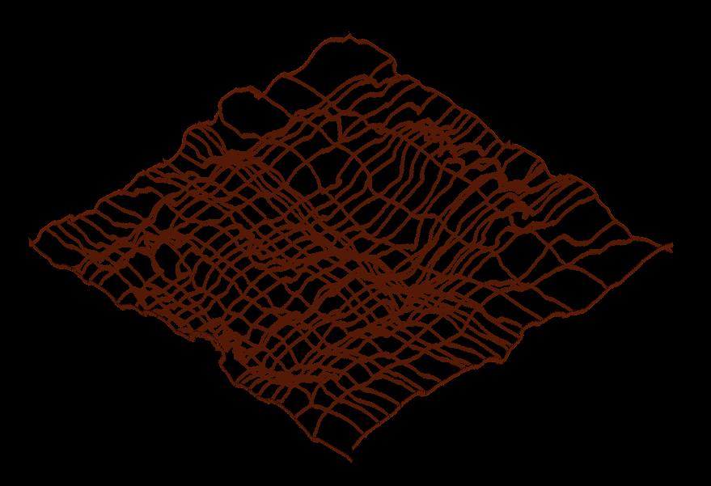
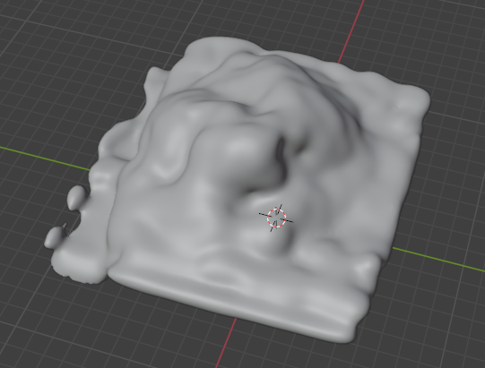

# Heightmap

NOT COMPLETED AT ALL. It may work in some cases where images are good enough, where images are well denoised, the diagonal line that appears when rotating the data does not influence at all and cells are as uniformelly stained as possible. Also known as __GOOD__ IMAGES.

Nontheless, I developed another way to achieve good results when working with deflated domes, wrinkled cells and wrinkled tissue.


# Initial top mask

This methods needs a human input before detecting the apical. Here are the steps to get this first input from an image named ```image_99_denoised_tp4```:

1. Load the image with name: image_99_denoised_tp4 
1. Open IPython Console and inside:
1. Write ```image = viewer.layers['image_99_denoised_tp4'].data``` to put the image inside the variable 
1. ```import numpy as np```
1. ```mask = np.zeros(image.shape, dtype=np.uint8)```
1. ```viewer.add_image(mask, name='mask')```
1. ```viewer.add_labels(viewer.layers['mask'].data)```
1. This will generate a label data that you can paing on. You should draw the top of the apical (more or less) at y and x direction. As you can see it is not super precise, in fact, it is a more or less delimitation with a brush of 10 px wide.



After that you are set to run the file that takes this manual input as the initial guess, then it blurs it and uses it to find the apical shape. It will find 2 different apicals; one y-sliced and the other x-sliced. It will sum both, remove the lateral dots using some margin value (20 for example) and get the gaussian. 

Then, using tif2blender you can load the gaussian, and make it into a mesh. 




# Automatic pipeline

We first tried to develop a method that could find the initial guess automatically. It is a complicated task due to the not __GOOD__ IMAGES. Nontheless it can work in cases where images meet those characteristics. This method works as follows:

1. Run dottamine on the image
1. Get the top (from top, left, and right) of dottamine's mask
1. Get the hull on dottamine to place non-bright enough cells
1. Get the blur of this sum

There is also another pipeline that calculates some parameters when placing the dots compared to the outlines of the mask and the borders.

The initial approach is thought to be the equivalent on the manual we have done. Then, we developed some other scripts that are able to get the apical shape of the cells. But during the development of this method we realized that the initial guess is crucial to have good apical results. 


# Benchmark

To benchmark the pipeline we compared the results between ours and LocalZProjector.