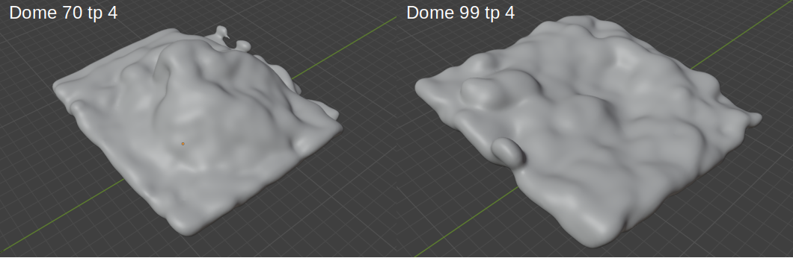
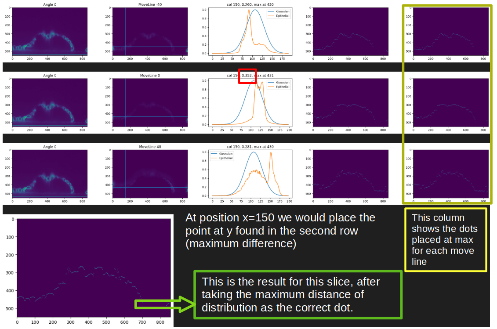

# Heightmap

NOT COMPLETED AT ALL. It may work in some cases where images are good enough, where images are well denoised, the diagonal line that appears when rotating the data does not influence at all and cells are as uniformelly stained as possible. Also known as __GOOD__ IMAGES.

Nontheless, I developed another way to achieve good results when working with deflated domes (since line is far from cells), wrinkled cells and wrinkled tissue.


# Initial manual top mask

This methods needs a human input before detecting the apical. Here are the steps to get this first input from an image named ```image_99_denoised_tp4```:

1. Load the image in napari named: image_99_denoised_tp4 
1. Open IPython Console and write:
1. ```image = viewer.layers['image_99_denoised_tp4'].data``` to put the image inside the variable called ```image```
1. ```import numpy as np```
1. ```mask = np.zeros(image.shape, dtype=np.uint8)```
1. ```viewer.add_image(mask, name='mask')```
1. ```viewer.add_labels(viewer.layers['mask'].data)```
1. This will generate a label data that you can paint on (select the layer to see the tools you can use). Those commands also generate an empty array called mask which you can delete. On the label layer you should draw the top of the apical (more or less) at y and x direction. As you can see it is not need to be super precise, in fact, it is a more or less delimitation with a brush of 10 px wide (we will later gaussian-blur it).


After that you are set to run [the file](./heightmap_multiscript/fromManual.ipynb) **change url and file position** that takes this manual input as the initial guess, then it blurs it and uses it to find the apical shape. It will find 2 different apicals; one y-sliced and the other x-sliced. It will sum both, remove the lateral dots using some margin value (20 for example) and get the gaussian. [*Later on this file*](#from-manual-to-apical) I explain how the process is concieved.

Then, using tif2blender you can load the gaussian, and make it into a mesh. 



Inside blender you can modify the threshold to have thinner or wider solid and also can turn adaptivity to one and select smooth shading.


# Automatic pipeline

We initially tried to develop a method that could find the initial guess automatically. It is a complicated task due to the not __GOOD__ IMAGES. Nontheless it can work in cases where images meet those characteristics. This method works as follows:

1. Run dottamine on the image
1. Get the top (from top, left, and right) of dottamine's mask
1. Get the hull on dottamine to place non-bright enough cells
1. Get the blur of this sum

The initial approach is thought to be the equivalent on the manual we have done. But during the development of this method we realized that the initial guess is crucial to have good apical results.

The idea of getting the hull mask from dottamine is that since the darkests cells are not detected, hull would enclose everything detected from dottamine, also non-visible cells.

From this two apical estimations (dottamine and hull) we can run a process that places the dots on the apical side of the cell trying to select whether to use the hull or the dottamine aproximation. This leads to some sparse points. **Maybe we should try to mix this and other process to get the right points.**

<!--There is also another pipeline that calculates some parameters when placing the dots compared to the outlines of the mask and the borders. -->


# Benchmark

To benchmark the pipeline we built some synthetic flat and curved monolayer and run Dottamine + Falling Line. We then added some noise on it and blurred vertically to make it realistic. Then, we also run LocalZProjector on it so we can compare the results obtained with our method to the commonly used tools.


# Visualisation or raw data in imagej

Open imagej and go to plugins &rarr; 3D script &rarr; Interactive animation. Then Animation &rarr; Start text-based animation editor. Write this to have a quite decent animation.

At frame 0: 
- reset transformation 
- zoom by a factor of 0.6
- rotate by 120 degrees around (0, 0, 1)
- rotate by -60 degrees around (1, 0, 0)

From frame 0 to frame 62:
- rotate by 90 degrees around (0, 1, 0)
- rotate by 45 degrees around (1, 0, 1)

From frame 62 to frame 125:
- rotate by 90 degrees around (0, 1, 0)
- rotate by 45 degrees around (1, 0, 1)

From frame 125 to frame 187:
- rotate by 90 degrees around (0, 1, 0)
- rotate by 45 degrees around (1, 0, 1)

From frame 187 to frame 250:
- rotate by 89 degrees around (0, 1, 0)
- rotate by 45 degrees around (1, 0, 1)


# Visualisation of mesh in blender

The steps to follow are the same as described in Mypose. The difference is that if you want to calculate curvature in meshlab or other software, you should reduce the amount of vertices and edges of the mesh for a faster calculation. Initially, a mesh that comes from a gaussian can have more than 2 million vertices. To reduce the amount of it add a modifier to the mesh (be careful to apply the mesh to the data before doing this). The modifier is Generate &rarr; Decimate. In Collapse reduce the ratio so the amount of faces is somewhere around 200k or 300k. It may take a while, but this will make the computation on the mesh much faster.


# Future work

This method aims to obtain the apical shape of the tissue but it is not as precise as I would like it to be. The perfect result would be to get a clear continuous line superposed on the apical (and also another on the basal) part of the cells. We encountered 2 problems: the first one is that the initial mask is not as good as needed to contiue the process. This we solved by skipping dottamine and drawing manually the contour of the tissue. The second problem is the final cleaning of the dots. There is none, so we depend on how well we can skip detecting non-good dots. If we could clean those outer dots, we could then obtain a super continuous line that descrived the apical, and meshing these dots, we would have a **perfect** mesh of apical.

Now we are stuck at getting the gaussian of the dots and meshing it to have the tissue shape of the system.


## From manual to apical

Starting from the [manual apical segmentation](#from-manual-to-apical) we make a blur of it. That's why we need some distributed lines in both x and y direction. 

The function that places dots across the apical goes slice by slice in y or x direction (you can choose to run both). The function needs the following inputs:
1. Denoised image
1. Gaussian first apical
1. A list containing all the angles to evaluate. This list will make the slice rotate from -angle to angle. e.g. can go from -40 deg to 40 deg with 20 deg step.
1. A list containing all the move line to evaluate. This will make the gaussian move higher and lower to better find the membrane of the cells. e.g. can go from -40 to 40 with 40 step.

Now we can use the function. Foreach angle will get as many guesses as move line we set. Then, foreach move line it will find the position of the maximum and also will evaluate the jensen_shannon_distance of the normalized distribution between the gaussian alone and the gaussian*image. The distance is evaluated at the range where gaussian is different than 0. We will keep the maximum where this distance is maximum among the move lines. We will do this foreach angle. Then we will sum all the angle's result.

At each image we also add a signal as a straight line at the bottom, so we make some sparse points go there in the case of existance.



This process is run on parallel foreach slice. It takes a bit more than 3 minutes for 750 slices.


