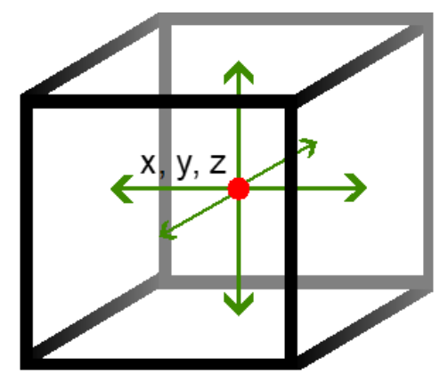

# Mypose

To use the developed watershed segmentation, prepare at least a 240, 240, 240 image stack of the cell of interest. Open the jupyer notebook and set the folder and the image_route variables. The program will read the image and plot a middle slice. 

You can center the cell and cut the image even more by filling z, y, x values (the center of the stack) and delta, which is the number of pixels taken from z, y, x value to each direction. 



Once selected the 3D block, the script will run a watershed algorithm on it. It will return a 3D image which contains all the watershed regions found. The image used and the labels found will be stored in 2 different files. Open napari and visualize them. 

By selecting the masks indexes and writing them down in the label_numbers list in the file, it will create a single mask with all the pieces. Later, this information is stored in a file called segment_file-v1.txt in case you need to recover any information since the same algorithm run on the same image will output the same regions. 

CAREFUL: If the cell is not well being detected, try correcting the image by doing some color or gamma correction.  

To recover more of the membrane shape, there is a second part of the algorithm which does watershed again but applying a sobel kernel on the image and removing the mask found before. The output will be a 3D array with the different watershed regions found. Open it in napari and again write the masks indices in label_gradient_numbers. Save the total mask and at the end, the segmentation file will get updated with this label_gradient_numbers for further usage. 


# Napari mask correction / manual segmentation

In order to manually correct a mask open napari and drag the image used to get the segmentation and the obtained mask. Then open the IPython console and write: ```viewer.add_labels(viewer.layers[‘segmented_cell’].data)``` to create a Labels layer. In this layer you can manually draw or erase parts of the mask. Make sure you are using the same label to draw as the mask by clicking the Pick mode and selecting the mask. Switch the blending to additive to see the real image at the background. 

Save the Label file. 
