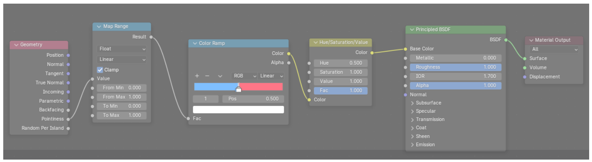

# Mypose

To use the developed watershed segmentation, prepare at least a 240, 240, 240 image stack of the cell of interest. Open the jupyer notebook and set the folder and the image_route variables. The program will read the image and plot a middle slice. 

You can center the cell and cut the image even more by filling z, y, x values (the center of the stack) and delta, which is the number of pixels taken from z, y, x value to each direction. 


Once selected the 3D block, the script will run a watershed algorithm on it. It will return a 3D image which contains all the watershed regions found. The image used and the labels found will be stored in 2 different files. Open napari and visualize them. 

By selecting the masks indexes and writing them down in the label_numbers list in the file, it will create a single mask with all the pieces. Later, this information is stored in a file called segment_file-v1.txt in case you need to recover any information since the same algorithm run on the same image will output the same regions. 

CAREFUL: If the cell is not well being detected, try correcting the image by doing some color or gamma correction. If it does not work, maybe the quality of the cell or the image is not good enough...   

To recover more of the membrane shape, there is a second part of the algorithm which does watershed again but applying a sobel kernel on the image and removing the mask found before. The output will be a 3D array with the different watershed regions found. Open it in napari and again write the masks indices in label_gradient_numbers. Save the total mask and at the end, the segmentation file will get updated with this label_gradient_numbers for further usage. 


# Napari mask correction / manual segmentation

In order to manually correct a mask open napari and drag the image used to get the segmentation and the obtained mask. Then open the IPython console and write: ```viewer.add_labels(viewer.layers[‘segmented_cell’].data)``` to create a Labels layer. In this layer you can manually draw or erase parts of the mask. Make sure you are using the same label to draw as the mask by clicking the Pick mode and selecting the mask. Switch the blending to additive to see the real image at the background. 

Save the Label file. 


# Blender 4.1

Download the [tif to blender](https://github.com/oanegros/tif2blender) zip. You can follow the installation instructions from github. But basically: 

1. Download the zip. 
1. Inside blender go Edit &rarr; Preferences &rarr; Add-ons. 
1. Click Install and search the zip. 
1. Install it and search it inside the Add-ons screen. 
1. Install tifffile from the import. 

After installation:

1. Press the layout of the scene, press ‘a’ and ‘x’ to remove everything.  
1. Go to the Scene icon in the right menu (it is a cone, a bubble and a ball). 
1. There you have the tif loader. Select the file. Be careful on the xy pixel size and z pixel size so the image is not distorted.  
1. In the axes, write zyx if it is a 3d tif. (I have not worked in multiple channel tif). Then press Load TIF. 
1. Some will have a box and the cell inside and some may not (I did not have it). 

1. In the top right menu unfold the Mesh icon (inverse orange triangle). There you will see an orange Data icon (like a cloud). This is the cell. You can modify the scale or the dimensions by clicking in the Layout and pressing ‘n’. A Transform menu will pop up in the right. If you write 1, 1, 1, you will have the cell sized 1px = 1m. That is not useful at all. If you write 0,1625 (which comes from 1px = 0,1625µm) in each axis you will have the cell dimensions as 1m = 1µm. 
1. Add &rarr; Mesh &rarr; Cube. 
1. In the right menu click the cube mesh. Go to modifiers &rarr; Add Modifier &rarr; Generate &rarr; Volume to Mesh.  
1. Click the Eyedropper Data-Block from the Object. Select the data of your cell (the orange cloud). In Grid Name write ‘channel 0’. If this does not work check the channel name of your data.  
1. Go on your orange Data icon (the cloud one) and unfold it. You will see the same icon but just with a green outer line. Press it.  
1. Press the same icon (Data, Object Data Properties) from the bottom right menu. 
1. In Grids, you should have the name of the data. It must be the same as the one from the Grid Name. 
1. Once you see a pixelated meshed cell, you can create the object. In the modifiers press the arrow next to the camera icon and press Apply. 
1. You can remove the initial data you imported with tif2blender (take into account that the Scale of the mesh is 1, 1, 1). 
1. Right Click on the mesh &rarr; Set Origin &rarr; Geometry to origin. You have centered the cell. 
1. In the left top corner you see Object Mode, Change to Edit Mode. 
1. Press ‘a’ (to select all the nodes) &rarr; Vertex &rarr; Smooth Vertices. Smooth the pixelated image. We have done Smoothing = 0.500, Repeat = 20. 
1. To change the color and texture. Shading &rarr; New (in the bottom window that has just popped up). There you can modify and create materials. Change the color, metallic, roughness, etc. 
1. If you press the viewport shading icon (top right of the window, it is a ball with some reflection) you will have the scene but as it will look when we further render it. 
1. Add lights via Add &rarr; Light. Select the light you want. You can move it around by pressing ‘n’ and making sure you have selected it in the right menu, or moving it through the Move icon.  
1. Also add a camera and place it somewhere that when you press ‘F12’ or Render &rarr; Render Image, you see what you want to see.  
1. Bottom Right menu &rarr; Render &rarr; Film &rarr; Transparent (for transparent background).  
1. Bottom Right menu &rarr; Output, to play around with size and fps for films. 
1. Rotate the cell through time: 
1. The transform menu that pops up when you press ‘n’ in the layout, you see Rotation. 
1. Write #frame/57.295 in the axis you want to have the cell rotating. 
1. At the bottom you see the time bar. Write the frames you want to render where it says End. 
1. Render a film: Right bottom menu &rarr; Output &rarr; Output &rarr; Select the folder, and file format (AVI JPEG). Press Ctrl+’F12’  or Render &rarr; Render Animation to render the film. More quality: Bottom Right Menu &rarr; Render &rarr; Render Engine &rarr; Cycles. 

Extra: If you want to have distinct colors for concave and convex, you can set up this material Node layout: 



It will only work with Render Engine &rarr; Cycles. 

# Meshlab 2023.12

MeshLab is the software used to paint the meshed cell and get a 3D heatmap on the cell about the desired feature. In this case we want to show the curvature. 

## Meshalb coloring

MeshLab is useful to open a stl mesh and color it by many parameters. The parameter of our interest is curvature. To do so you should open a new MeshLab window (linux: $ flatpack run net.meshlab.MeshLab). Just drag the stl file into the MeshLab window and it will show the mesh. To color the mesh in function of curvature: 

1. Filters &rarr; Color Creation and Processing &rarr; Colorize curvature (APSS). 
1. MLS – Filter scale &rarr; 10 (in order to smooth the coloring). 
1. Render &rarr; Show Vertex Quality Histogram. 

Meaning of the values (important): 

The values of the histogram are dependent on the scale that blender gave to the mesh. Because when you import the mesh in blender it may change the scale or dimensions. There are 2 ways to solve this issue: 

1. In Blender 
1. Load the tif. 
1. On the right panel you will see your Scene Collection. If you open it, you will see a blender orange data icon (like a cloud). There you have the data. 
1. Click on the scene and press ‘n’. A Transform menu will pop up.  
1. You can see the scale. If you write 1, 1, 1, you will have the cell sized 1px = 1m. That is not useful at all. If you write 0,1625 (which comes from 1px = 0,1625µm) in each axis you will have the cell dimensions as 1m = 1µm.  
1. Scale the Histogram 
1. If you do not change the scale in blender, change the numbers in another program. 
1. To get the correct numbers you must divide them by (0,1625/0,02). 
1. 0,1625 being the 0,1625µm per pixel in the image. 
1. 0,02 being the scale of the data in blender (scale in the Transform menu). 

Back in Meshlab

1. In the Right part of the window there is a droppable element entitled Show Vertex Quality Histogram. There you can Modify the range of the histogram, the number of bins, if you want to normalize the histogram, etc. If you want to modify the Histogram range check the Fixed Width box. 
1. Filters &rarr; Quality Measure and Computations &rarr; Quality Mapper applier (Minimum mesh quality and Maximum mesh quality should be the same as in the Show Vertex Quality Histogram to get the color gradient in the correct same range). 
1. Click on the Quality Mapper button (top bar like a rabbit or so) or search through the search icon. Here you see the colors. 
1. Select the Preset Ramp you like (or create one by moving the colors around, intuitive).  
1. In the Equalizer write the same values you have used for the histogram.  
1. BEFORE Applying the changes write 50% in the % box to have the transition color placed in the middle of the histogram. 
1. Click Apply. 
1. If you see that changes do not apply on the Histogram repeat step 3 to render the histogram again, unchecking and checking the box. 
1. If you want to get nice screenshots click the camera icon and select the Output folder, and Background (there is a transparent one). 

MeshLab ‘movie’ 

MeshLab is not created to do so. BUT you can capture multiple images and stack them in ImageJ. If you did not move the mesh at all, you still have the default orientation. To move the cell a known amount of degree: 

1. Windows &rarr; View from &rarr; Get the view you like. 
1. Filters &rarr; Mesh Layer &rarr; Matrix: Set from translation/rotation/scale. 
1. Check the Preview box and orient it as you like. Once you have it click Apply. 
1. Click Default to reset all numbers. 
1. Uncheck Preview. 
1. Now in the Rotation Axis you want, write the ∆º you want. Now, every time you click on Apply, the cell will move this amount of º. 
1. Every time you move the cell save a snapshot. 
1. Open ImageJ. 
1. File &rarr; Import &rarr; Image Sequence 
1. Browse the folder where you have the snapshots and make sure you checked the Sort names numerically checkbox. &rarr; OK. 

The image stack will have white background. 