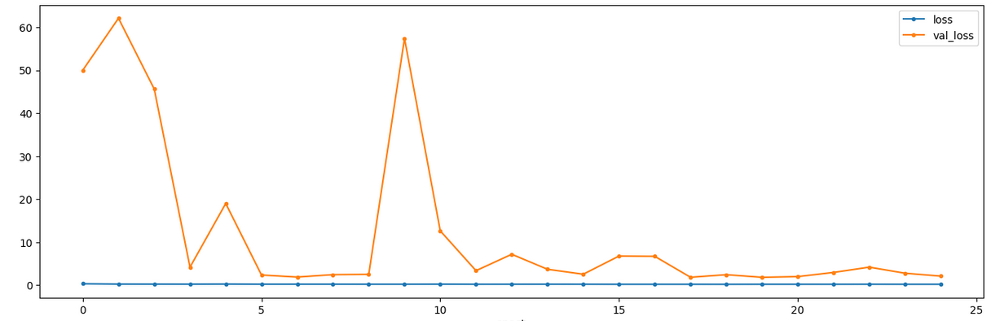

# Noise2Void

Denoise images using a pretrained model or train your own. Important: n2v only works with determined tensorflow versions. Make sure to check and install the correct one. If versions are incompatible, you will get an error when training the model. 

## Train model 

CAREFUL: Change the name of the model if you want to train a new one since it will OVERWRITE the existing one!! 

The model trained and used in all the domes is called 2d_images_from_stack. This file trained the model using a single 3d inflated dome image top to bottom without considering the 0 value columns (that appear when processing the data). 

This way the model is trained on interpolated and real data, not on 0 added data. The images used are the ones in z direction. 

The patches used (N2V cuts an image into patches of a determined dimension) are 64x64. From a single image we can generate >38,000 patches but we will use 10,000 to train the model.  

The script works as follows: 

- Import the necessary python libraries. 

- Import the 4D data stack from the directory and filter by its name. Also tell the dimensions as TZYX. 

- Remove the vertical black strip of each image and append it into a list. No matter if they are sized differently since N2V trains the model using patches of smaller size. 

- Then we generate the patches manually iterating over the list of images and overcoming the smaller possible patches. Select how many patches will be used for training and how many for validating. If the ration is not high enough (90% training 10% validation) you will have a lot of validation loss. For some, a high validation loss means the model is underfitting and for other some is means that the model is overfitting and unable to generalize to other data. To me, it may mean that you used a lot of data to validate the model compared to the one used to train the model. 
I think that is tremendously important to somehow randomize the patches when dividing the data into training and validation patches. 
- We configure the model (follow the guideline of https://github.com/huglab/n2v). 
- Name the model and train it. 
- Finally look the training and validation loss and export the model. 

To see the difference between training a model with almost 50% training data and 50% validation data (not good) and on top of that, non-shuffled patches, see the error across the 25 train steps per epoch: 

This is the model called 2d_images_from_stack. Remember that we remove the 0 intensity part of the image that appears when processing the image.  

The second model called 2d_images_from_stack_version2 considers a good training-validation data amount. Although the training steps per epoch are 20 times smaller, the data variation is much higher since we used a single tp dome (>200,000 64x64 patches). The patches among the training and the validation data are shuffled. See the error across the 25 train steps per epoch: 

This plot is much better than the one shown before since the error is less than 1 in all cases and it diminishes to get to a plateau. With 10 train steps per epoch instead of 25 would have been enough since the error does not diminish anymore.  

Training a deep learning model is a balance between the number of training epochs, train steps per epoch and of course, the amount and range of data used. 

To sum up noise to void I would say that it is able to separate the noise of the signal and do gaussian blur on the noise and on the signal but in a way that both layers are not mixed. 

## Use the model

The file denoiseDome.ipynb denoises the dome top to bottom 2D sliced. It is set to work with 4D domes, but this can be changed since the model predicts 2D images. 

First, we need to set the path and the dome to be denoised, also where to save the dome and the name of the denoised dome.  If the input is 4D, the dimension of the image is going to be TZXY, but if it is 3D the dims will be ZYX and if it is 2D, YX. Then, the algorithm will go through each 2D slice and denoise it. 

Just write the relative path of the dome and the name of the dome to be denoised. Also write the relative path where the dome must be saved. Then, if you do not need a special name for the denoised image, just leave the preset name of the denoised dome, which will be the same as the original image but with _denoised. Finally write the dimensions of the image. Remember: 
- TZYX for 4D dome 
- ZYX for 3D dome 
- YX for 2D dome 

The output of N2V is a 32-bit image and sometimes the Z layer value is switched with the channel value. To fix this open it in ImageJ, convert it to 16-bit and (Ctrl+Shift+P) and switch the values to suit it to the original data shape. 

